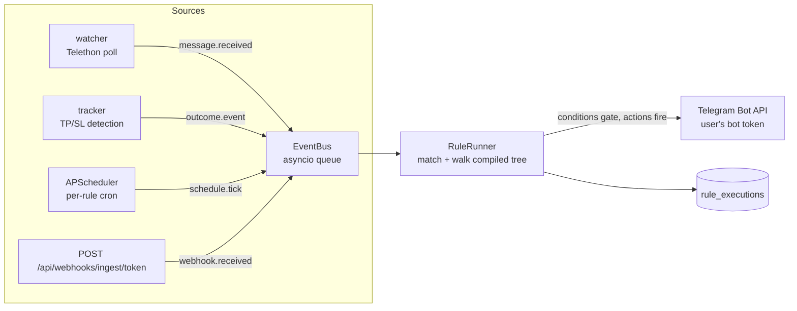

# Tapwire

Tapwire is a Telegram channel management and automation platform. It gives you a chat workspace for the channels you run or watch, a library of reusable message templates (text + GIF), and a visual rule builder that turns events — incoming messages, signal TP/SL outcomes, cron schedules, inbound webhooks — into automated posts via your own Telegram bot.

- **Traders / signal providers** — auto-post TP-hit celebrations, forward signals between channels, push trade-watcher webhooks straight into Telegram.
- **Marketers** — schedule recurring posts, reuse templates with variables, keep media assets in one library.
- **Community managers** — mirror announcements across channels, keyword-triggered replies, one inbox for channel messages.

## Features

- Chat workspace: read and send messages per channel (last 200 messages kept per channel)
- Message templates with `{variables}`, HTML/Markdown parse modes, attached GIF/photo media
- Media library (GIF/MP4/PNG/JPG/WebP uploads, 10 MB cap, Telegram `file_id` caching)
- Visual Trigger → Condition → Action rule builder (React Flow), compiled and validated at save time
- 4 trigger types: message received, signal outcome (TP/SL), cron schedule, inbound webhook
- Loop protection: self-sent message skip, per-rule rate limit with auto-disable, event dedup
- Execution log with per-node trace, dry-run rule testing
- Signal intelligence carried over from v1: parser, outcome tracker, channel scoring

## Quickstart

**Docker (dev):**

```bash
cp .env.example .env   # set SECRET_KEY at minimum
docker compose up      # backend :8000, UI dev server :3000
```

**Bare metal:**

```bash
pip install -r requirements.txt
python run.py                      # API + built SPA on :8000

cd ui && npm install && npm run dev   # Vite dev server on :3000
```

**Production:** `docker compose -f docker-compose.prod.yml up -d` — multi-stage build, nginx on :80 (see `infra/` for AWS Terraform).

## The two-credential model

Tapwire separates *reading* Telegram from *writing* to it:

| | READ | WRITE |
|---|---|---|
| Protocol | MTProto user session (Telethon) | Bot API |
| Credential | `TELEGRAM_API_ID` / `TELEGRAM_API_HASH` / `TELEGRAM_SESSION` env vars | Per-user bot token from @BotFather |
| Scope | Server-level, shared | Per user, Fernet-encrypted in the DB |
| Used by | watcher (polls watched channels) | automation engine actions, manual send |
| Setup | `docs/setup-telegram.md` part A | Settings → Telegram in the app (part B) |

A user can run automations without the server having any READ credentials (schedule + webhook triggers don't need the watcher).

## Architecture



Single FastAPI process serves the API and the built React SPA. SQLite (WAL) is the only datastore. See `docs/architecture.md`.

## Environment variables

| Var | Required | Default | Purpose |
|---|---|---|---|
| `SECRET_KEY` | **yes** | — | JWT signing + Fernet encryption key material |
| `TELEGRAM_API_ID` | no | — | READ credential (my.telegram.org) |
| `TELEGRAM_API_HASH` | no | — | READ credential |
| `TELEGRAM_SESSION` | no | — | Telethon StringSession for the watcher |
| `DATABASE_PATH` | no | `data/tapwire.db` | SQLite location |
| `MEDIA_DIR` | no | `data/media` | Uploaded media storage |
| `WATCHER_POLL_INTERVAL` | no | `5` | Seconds between channel polls |
| `ALLOWED_ORIGINS` | no | localhost origins | CORS allowlist |
| `PORT` | no | `80` | nginx published port (prod compose) |
| `LOG_LEVEL` | no | `info` | debug/info/warning/error |

## Testing

```bash
python3 -m pytest
```

## Docs

- [Architecture](docs/architecture.md) — modules, event flow, DB schema, retention
- [Rule engine](docs/rule-engine.md) — events, node types, compiled trees, loop protection
- [Telegram setup](docs/setup-telegram.md) — READ and WRITE credentials step by step
- [Webhooks](docs/webhooks.md) — ingest contract and integration examples
- [Infrastructure](infra/README.md) — AWS Terraform (defined, not deployed)
